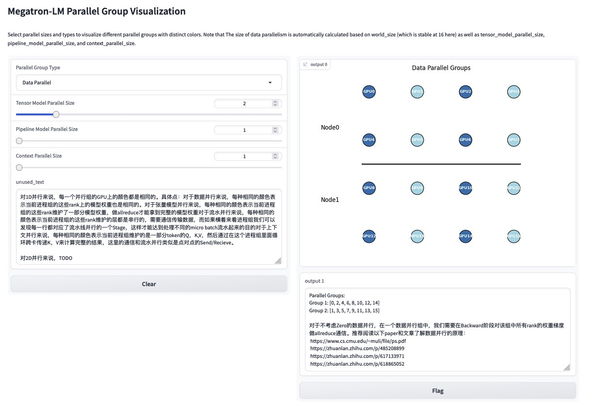
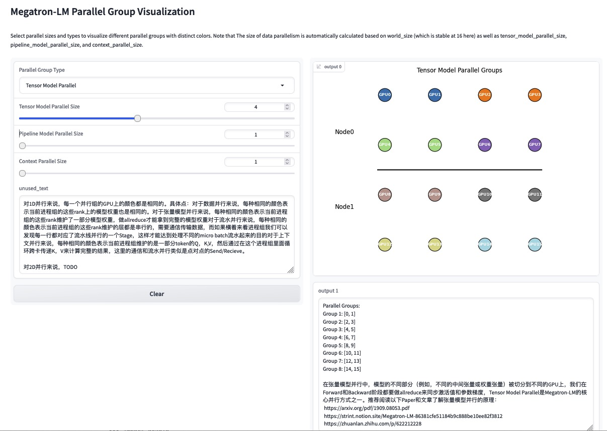
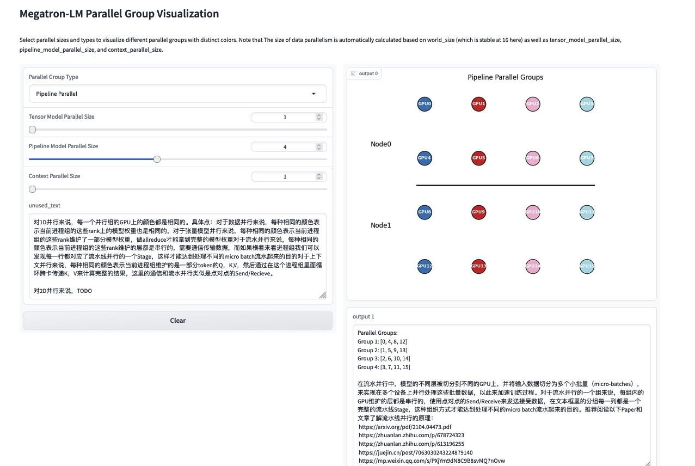
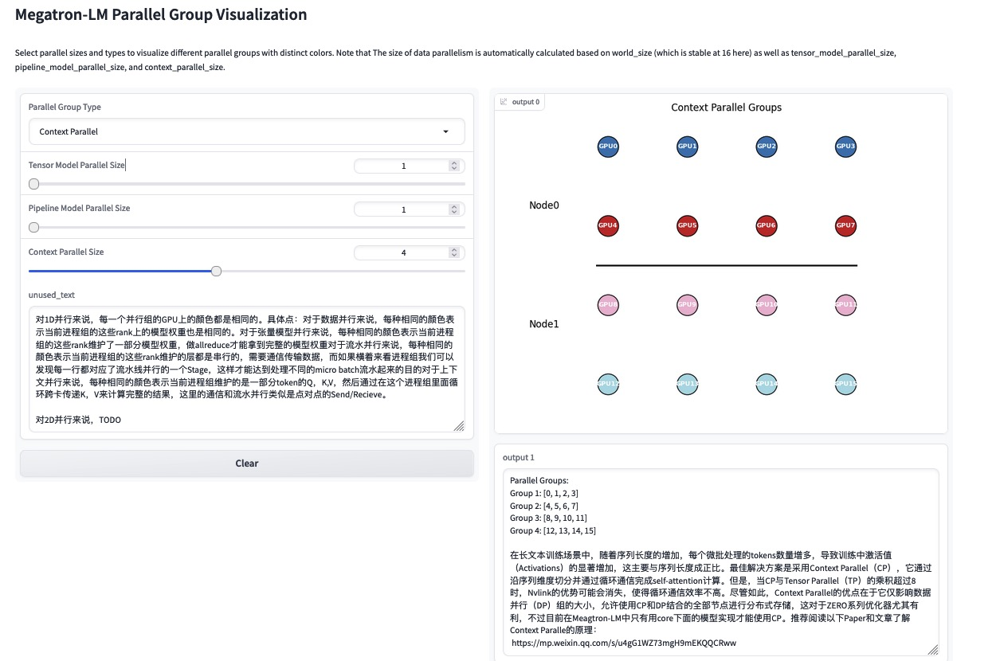

## Megatron-LM Parallel Group Playground

This is a playground for parallelism group display in Megatron-LM.

### 1. requirements

- gradio>=4.16.0

### 2. deploy

```python
python3 playground.py
```

then open the link created by gradio.


You can also try [this](https://82dd90f8a1dfbf75d1.gradio.live/) temporary link.

### 3. display example

#### 3.1 Data Parallelism Group



#### 3.2 Tensor Parallelism Group



#### 3.3 Pipeline Parallelism Group



#### 3.4 Context Parallelism Group



## Plan
- [ ] 2D Parallelism Group support
- [ ] 3D Parallelism Group support
- [ ] Zero
- [ ] Collective Communication Display

contributions and issues are welcome.

## Reference

- [Megatron-LM](https://github.com/NVIDIA/Megatron-LM)
- [gradio](https://github.com/gradio-app/gradio)

